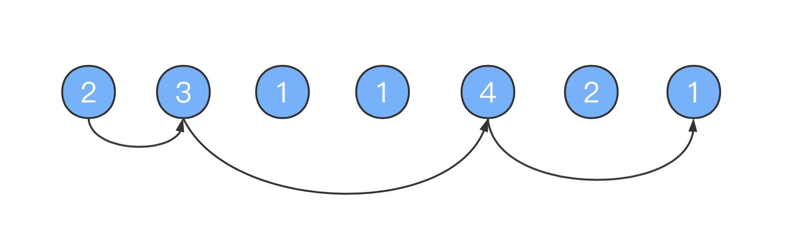
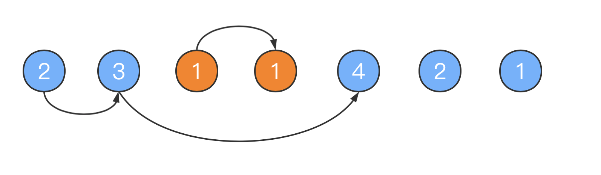
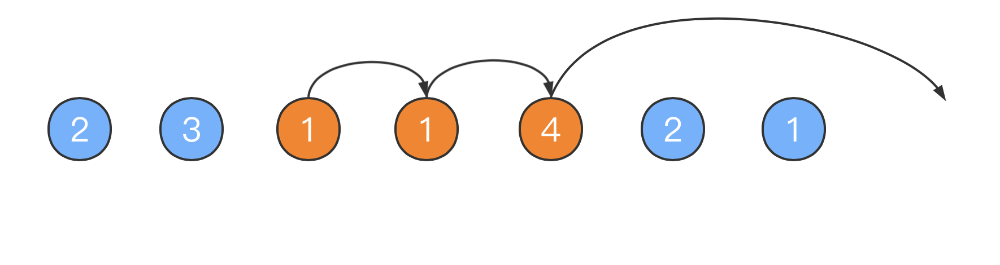

## 跳跃游戏 

给定一个非负整数数组，你最初位于数组的第一个位置。
数组中的每个元素代表你在该位置可以跳跃的最大长度。
你的目标是使用最少的跳跃次数到达数组的最后一个位置。

示例:
```
输入: [2,3,1,1,4]
输出: 2
解释: 跳到最后一个位置的最小跳跃数是 2。
     从下标为 0 跳到下标为 1 的位置，跳 1 步，然后跳 3 步到达数组的最后一个位置。
```

说明:
>假设你总是可以到达数组的最后一个位置。
 
### 解题思路
这道题是典型的贪心算法，通过局部最优解得到全局最优解

### 方法一：反向查找出发位置 
我们的目标是到达数组的最后一个位置，因此我们可以考虑最后一步跳跃前所在的位置，该位置通过跳跃能够到达最后一个位置。

如果有多个位置通过跳跃都能够到达最后一个位置，那么我们应该如何进行选择呢？我们可以「贪心」地选择距离最后一个位置最远的那个位置，也就是对应下标最小的那个位置。因为只有选择距离末尾最远的位置，才最接近开始位置，才可能跳跃次数最少，
因此，我们可以从左到右遍历数组，找到第一个能够跳到末尾的那个index就是我们要找的

找到最后一步跳跃前所在的位置之后，我们继续贪心地寻找倒数第二步跳跃前所在的位置，以此类推，直到找到数组的开始位置结束。




从左到右跳的话是 2 -> 3 ->4 ->1
从右到左的话，我们找能跳到 1 的位置，我们找的只能是 4 或者是 4 右边的2和1
我们选择4是，因为他是距离末尾最远的位置，找到了最后一步跳跃前所在的位置
以此类推，直到找到数组的开始位置结束。

```
int minSteps1(int *nums,int size)
{
    int position = size - 1;
    int steps = 0;
    while (position > 0) {
        for (int i = 0; i < position; i++) {
            if (i + nums[i] >= position) {
                position = i;
                steps++;
                break;
            }
        }
    }
    return steps;
}
```

#### 复杂度分析
时间复杂度：O(n²)，其中 n 是数组长度。有两层嵌套循环，在最坏的情况下，例如数组中的所有元素都是 1，position 需要遍历数组中的每个位置，对于 position 的每个值都有一次循环

空间复杂度：O(1)。

### 方法二：正向查找可到达的最大位置
正向查找，在当前跳跃范围内遍历，找到下次跳跃能到达的最远距离，就是这次跳跃的最佳选择

如下图，开始的位置是 2，可跳的范围是橙色的。如果选择跳到3的话。下次就可以跳3格，所以最远距离是4，如果选择1的话，下次可以跳1格，最远距离是3，因为选择3可以跳的更远，所以跳到3的位置



如下图，然后现在的位置就是 3 了，能跳的范围是橙色的，然后因为 4 可以跳的更远，所以下次跳到 4 的位置。



在具体的实现中，我们维护当前能够到达的最大下标位置，记为边界。我们从左到右遍历数组，到达边界时，更新边界并将跳跃次数增加 1。

```
int minSteps2(int *nums,int size)
{
    int currMaxIdx = 0;   // 当前跳跃范围最远坐标
    int nextMaxIdx = 0;   // 下一个跳跃范围最远坐标
    int steps = 0;        // 步数
    int target = size - 1;
    for (int i = 0; i <= currMaxIdx; ++i) {   // 在当前跳跃范围内遍历，获得下次跳跃能到达的最远距离
        nextMaxIdx = max(nextMaxIdx, i + nums[i]);
        if (nextMaxIdx >= target){
            return steps + 1;     // 提前结束
        }
        if (i == currMaxIdx) {    // 更新跳跃范围与跳跃次数
            currMaxIdx = nextMaxIdx;
            ++steps;
        }
    }
    return steps;
}
```

#### 复杂度分析
时间复杂度：O(n)

空间复杂度：O(1)

   ---------------------------------
      
      
